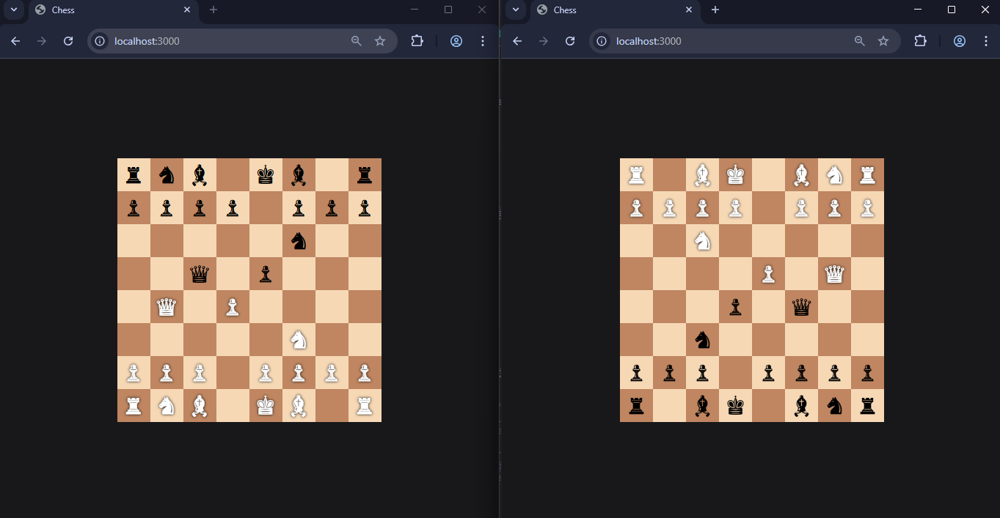

# ♟️ Real-Time Multiplayer Chess (Node.js + Socket.IO)

A real-time multiplayer chess game built using **Node.js**, **Express**, **Socket.IO**, and **chess.js**.
Play chess with another player in the browser with live move synchronization.

---

## 🚀 Features

* ♟️ Real-time multiplayer gameplay
* 🔄 Live board updates using Socket.IO
* 🎯 Drag and drop chess pieces
* 👥 Automatic player assignment (White / Black / Spectator)
* 📡 Server-side move validation using chess.js
* 🎨 Simple and responsive UI with TailwindCSS

---

## 🛠️ Tech Stack

**Frontend:**

* HTML (EJS templates)
* Tailwind CSS
* Vanilla JavaScript

**Backend:**

* Node.js
* Express.js
* Socket.IO

**Game Logic:**

* chess.js

---

## 📁 Project Structure

```
chess-app/
│
├── public/
│   └── js/
│       └── game.js        # Frontend game logic
│
├── views/
│   └── index.ejs         # UI template
│
├── app.js                # Server + Socket logic
├── package.json
└── README.md
```

---

## ⚙️ Installation & Setup

### 1. Clone the repository

```bash
git clone https://github.com/mazahirx/chess_io.git
cd chess_io
```

### 2. Install dependencies

```bash
npm install
```

### 3. Run the server

```bash
node app.js
```

### 4. Open in browser

```
http://localhost:3000
```

---

## 🎮 How It Works

* First user → assigned **White**
* Second user → assigned **Black**
* Additional users → become **Spectators**
* Moves are:

  * Sent to server via Socket.IO
  * Validated using chess.js
  * Broadcasted to all clients

---

## 📸 Demo (Optional)



---

## 🧠 Future Improvements

* ✅ Highlight legal moves
* 🔁 Board flip for black player
* ♜ Replace Unicode with SVG chess pieces
* ⏱️ Add timers (Blitz / Rapid)
* 💬 In-game chat
* 🏁 Game over detection UI (Checkmate, Draw)
* 🔐 Authentication system

---

## 🐛 Known Issues

* Unicode chess pieces may render differently across browsers
* No move highlighting yet
* No undo functionality

---

## 🤝 Contributing

Pull requests are welcome. For major changes, open an issue first to discuss what you'd like to improve.

---

## 📄 License

This project is open-source and available under the **MIT License**.

---

## 👨‍💻 Author

**Mazahir Mehdi**

* GitHub: https://github.com/mazahirx

---

## ⭐ Support

If you like this project, give it a **star ⭐** on GitHub!

---
